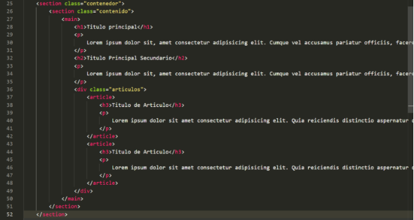

Tutorial de Pág Web Básica

# Taller HTML y CSS Parte 1

En este ejercicio desarrollaremos una página con las siguientes características:

Página index.html:

Página conocenos.html:

Pagina carritocompras.html:

Página cuenta.html:

Para poder realizar esta actividad es necesario, crear un árbol de directorios con la siguiente estructura:

- Para el archivo index.html recomendamos la siguiente estructura:

Para ir avanzando poco a poco configuraremos el header como se muestra en la imagen a continuación, en este configuraremos la etiqueta nav, con un pequeño menú:

Para la sección de clase contenedor, colocaremos una etiqueta section de clase contenido, con etiquitas h1p y h2, también pondremos una etiqueda div de clase artículos, con etiquetas article, h3 y p:

Y terminamos con el footer:

Para la página conocenos.html:

E header como se muestra en la imagen a continuación, tendrá el mismo  menú:

La sección de clase contenedor tendrá una sección de clase contenido con 2 divisiones: 1. Para el aside y otra para el div de clase formulario:

Para la etiqueta aside tendremos la siguiente configuración de etiquetas:

Para la etiqueta div del formulario usaremos la siguiente estructura:

El footer se conservará igual en todas las páginas.

Para la página carritocompras.html:

La sección contenedor del carrito tendrá la siguiente estructura:

Y por ultimo el archivo de la cuenta:

Para esta pagina tendremos una sección  contenido que tendrá un aside con clase lateral:

En la etiqueta aside tendremos unos títulos h2 y h3 para el nombre y el cargo, además crearemos una tabla:

Para la etiqueta main usaremos esta estructura:

Dentro de cada div de clase lista pondremos una lista ordenada con lo que se solicita en el comentario:

Al terminar de crear las estructuras debemos guardar y validar la navegación entre cada página.

Ahora procederemos a realizar los estilos de nuestra página, para ello creamos el archivo en la ruta indicada: pagweb/public/css/estilo.css

